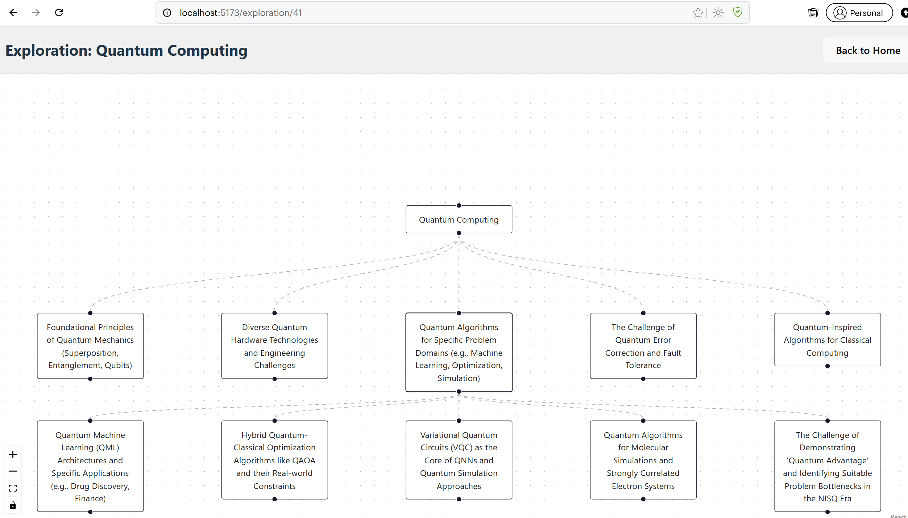

# Rabbit Hole Explorer

Rabbit Hole Explorer is an AI-powered knowledge graph explorer that generates interactive topic maps from a single prompt. It combines web search, LLM reasoning, a graph-oriented backend, and a React-based visualization layer so users can start with a topic and progressively expand it into a structured exploration graph.

## Overview

The system is designed to turn open-ended curiosity into a navigable graph. A user enters a topic, the backend gathers search context, an LLM proposes related concepts, and the application stores the result as an exploration graph. From there, users can expand any node to continue moving deeper into the rabbit hole.

## Key Features

- AI topic exploration powered by Google Gemini and Tavily search
- Knowledge graph generation persisted through FastAPI, SQLAlchemy, and PostgreSQL
- Interactive graph visualization built with React Flow
- Node expansion to grow the graph using additional LLM-generated concepts
- Python CLI client for API testing and backend verification
- Automatic hierarchical graph layout using Dagre

## Architecture

The system follows a straightforward service-oriented flow:

`Frontend -> FastAPI backend -> AI services -> PostgreSQL graph database`

- The React frontend provides the graph UI and interaction model.
- The FastAPI backend exposes graph-generation and graph-expansion endpoints.
- Tavily provides fresh topic context from the web.
- Google Gemini turns that context into structured concept suggestions.
- PostgreSQL stores explorations, nodes, and edges for retrieval and continued expansion.

## System Architecture

See [docs/architecture.md](/mnt/d/projects/rabbit-hole-explorer/docs/architecture.md) for the full breakdown.

```text
User -> React + Vite -> FastAPI -> Tavily + Gemini -> PostgreSQL
```

## How AI Generation Works

1. A user submits a seed topic.
2. The backend fetches relevant search context through Tavily.
3. The application builds a prompt that combines the topic and web context.
4. Gemini returns a list of related concepts.
5. The backend stores the root topic, generated nodes, and connecting edges in PostgreSQL.
6. The frontend fetches the graph and renders it using React Flow with Dagre-based layout.

## How Graph Expansion Works

1. The user clicks an existing node in the graph.
2. The backend uses that node title as a new exploration prompt.
3. Tavily and Gemini generate additional related concepts for that node.
4. New child nodes and edges are added to the same exploration graph.
5. The frontend refreshes the graph and recalculates layout automatically.

## Project Structure

- `backend/`: FastAPI application, database models, API routes, service layer, and AI integrations
- `frontend/`: React + Vite application for interactive graph visualization
- `cli/`: Python CLI utilities for testing and exercising the API from the terminal
- `docs/`: architecture notes and repository assets such as screenshots

## Installation

### Backend

Create a Python virtual environment, install the backend dependencies, configure environment variables, and start the API.

```bash
python -m venv venv
source venv/bin/activate
cd backend
pip install -r requirements.txt
cp .env.example .env
uvicorn app.main:app --reload
```

Required environment variables in `.env`:

- `DATABASE_URL`
- `GEMINI_API_KEY`
- `TAVILY_API_KEY`

### Frontend

Install the frontend dependencies and start the Vite development server.

```bash
cd frontend
npm install
npm run dev
```

### CLI Tests

With the backend running locally on `http://127.0.0.1:8000`, execute the CLI verification flow:

```bash
python cli/explorer_cli.py test
```

## API Endpoints

### `POST /api/v1/explore`

Creates a new exploration from a seed topic and returns an `exploration_id` plus the generated concepts.

### `GET /api/v1/explorations/{id}`

Returns the stored graph for a specific exploration, including nodes and edges.

### `POST /api/v1/nodes/{node_id}/expand`

Expands an existing node by generating new child concepts and edges.

### `GET /api/v1/explorations`

Lists stored explorations for browsing or frontend selection.

## Application Screenshot



## Screenshots

Interactive knowledge graph generated by the system.


## Problem Solved

Rabbit Hole Explorer addresses a common gap in AI-assisted research: model output is often linear, short-lived, and difficult to revisit. This project turns that output into a persistent, explorable graph so users can investigate how related ideas branch, cluster, and deepen over time.

## Technical Challenges

- Translating unstructured LLM output into stable graph data
- Combining fresh web context with prompt generation in a repeatable service flow
- Preserving graph integrity as nodes expand incrementally
- Presenting larger topic maps in a readable interface with automatic layout

## System Design Choices

- FastAPI was chosen for a clean async-friendly API layer.
- SQLAlchemy and PostgreSQL provide a simple but extensible graph persistence model.
- React Flow handles graph interaction without forcing a custom rendering engine.
- Dagre improves readability by producing a hierarchical layout instead of ad hoc node placement.
- A CLI client keeps backend verification lightweight and scriptable.

## Future Improvements

- User authentication and per-user exploration history
- Saved and shareable explorations
- Graph export to JSON, PNG, or Markdown outlines
- Automated multi-step AI exploration beyond single-click expansion

## Author

This project demonstrates backend architecture, AI integration, and interactive graph systems in a single full-stack application. It is intended to showcase practical system design, external API orchestration, and graph-based user experience design in a portfolio setting.
